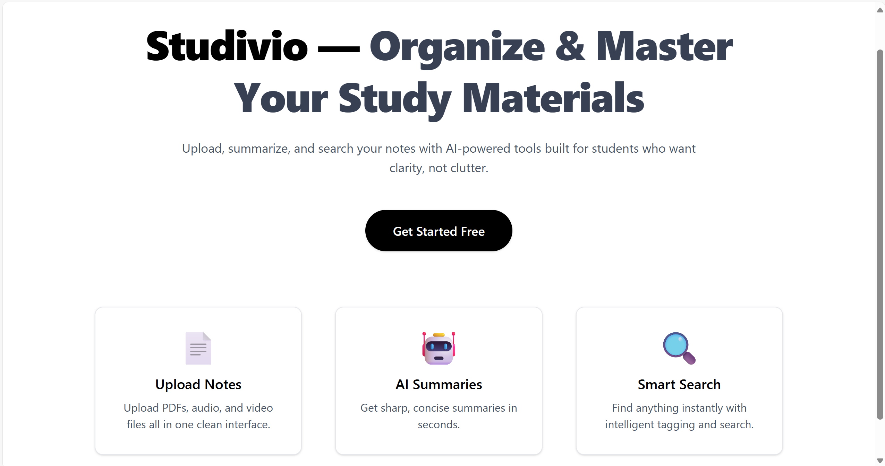
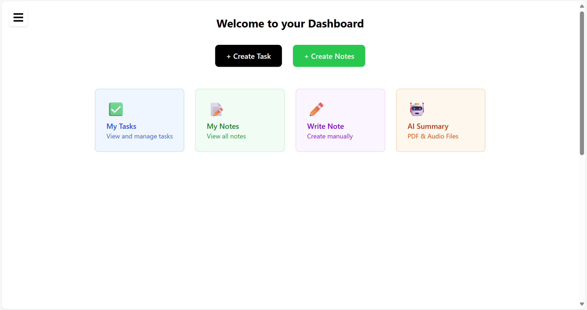
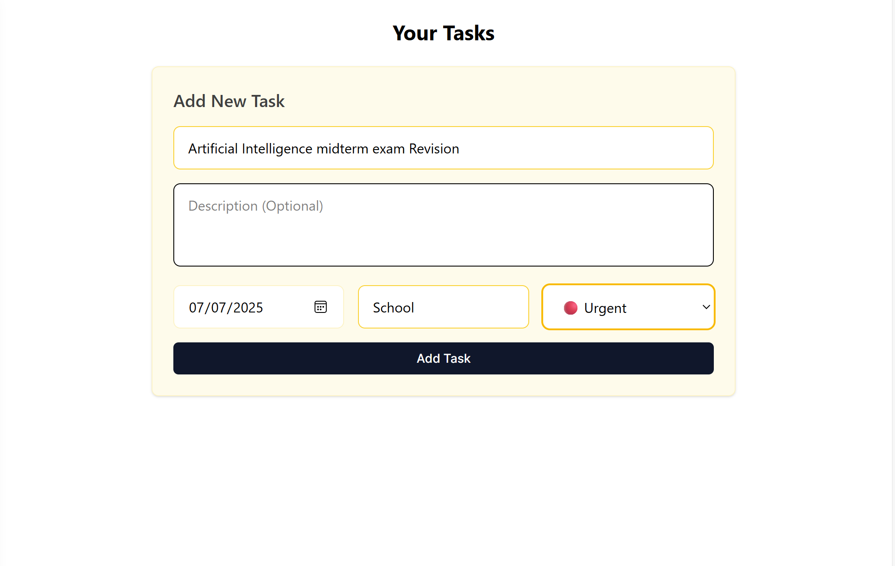
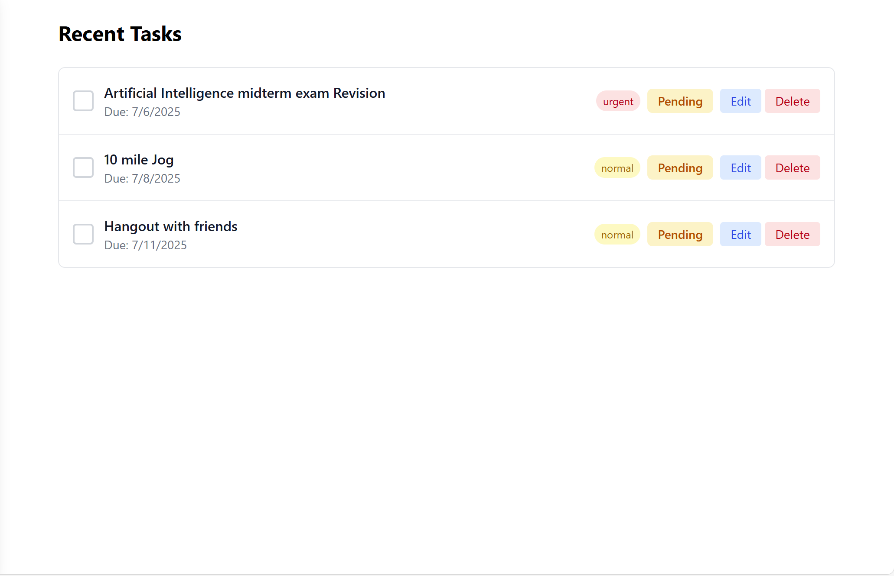
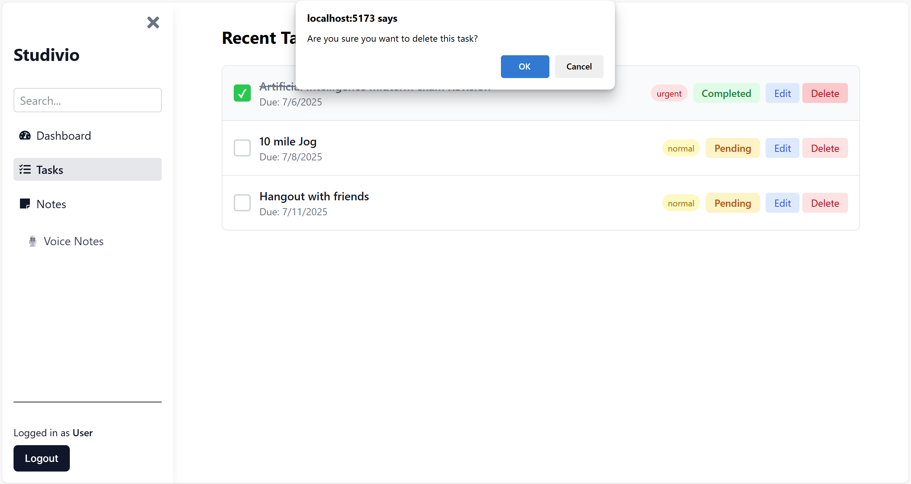
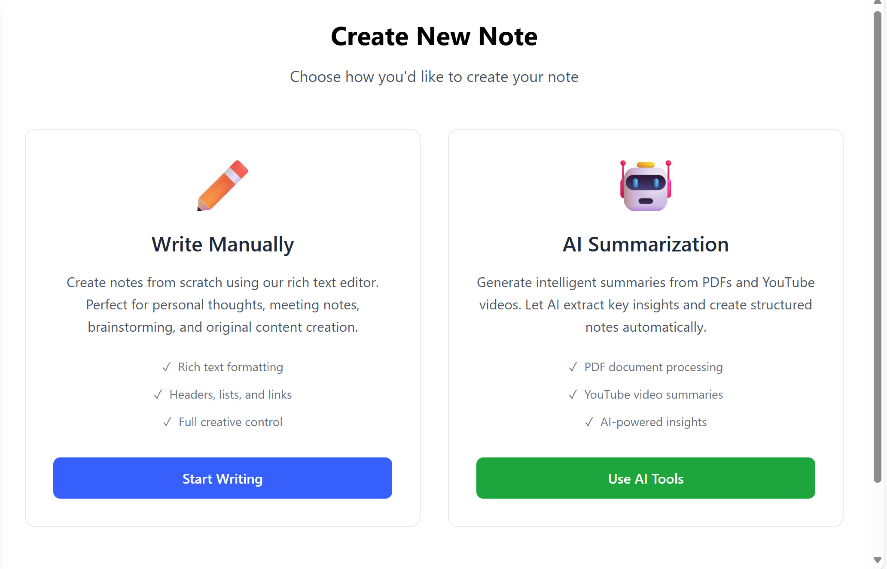
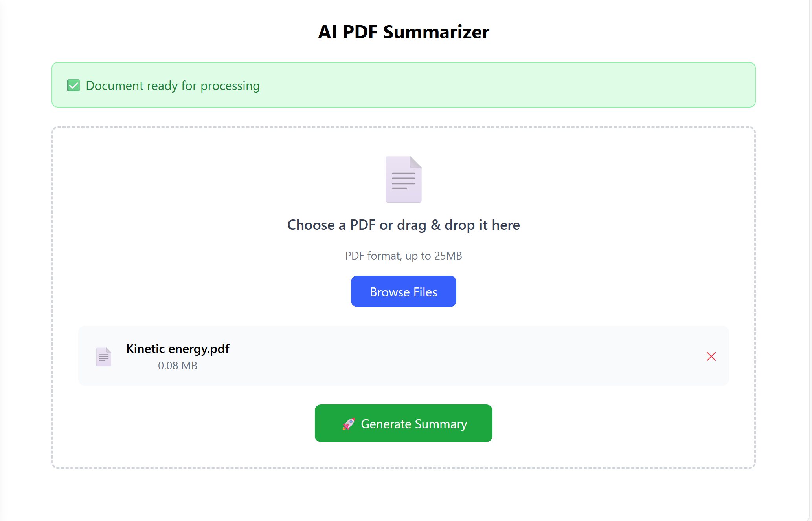
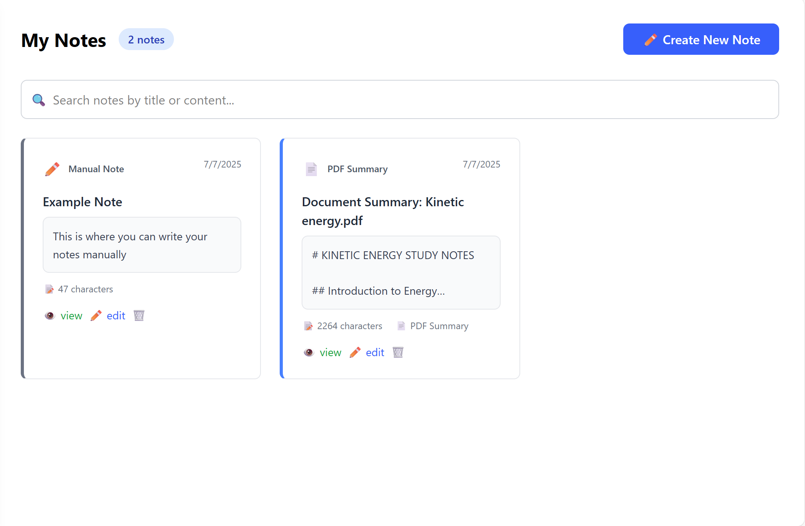
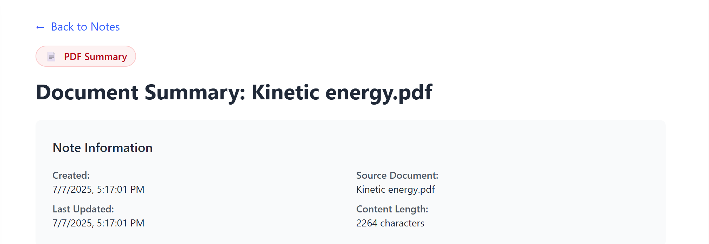
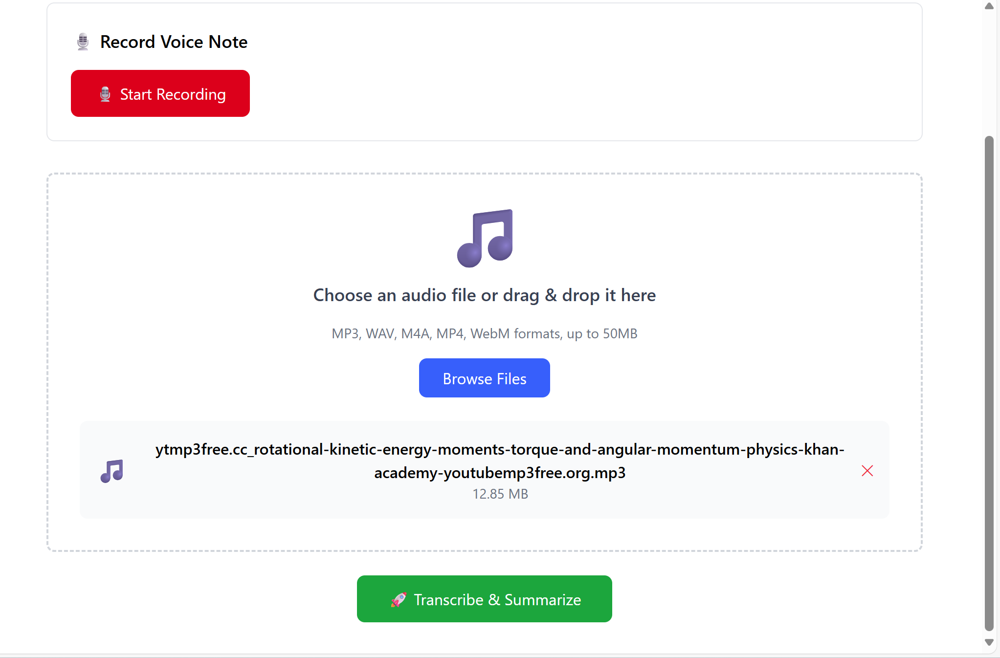

# Studivio
Studivio is a student productivity and notes taking application that helps students to use modern technology to organize and process their day to day activity and study materials

## 🎯 Overview
Studivio combines traditional note-taking with AI-powered content processing to help students efficiently organize and understand their study materials. Whether you're recording lectures, processing PDF textbooks, or creating manual notes, Studivio transforms your content into structured, searchable knowledge.
## ✨ Features

### 📝 Smart Note Creation

#### 🖊️ Manual Text Notes
- Traditional typing with clean formatting
- Rich text editing capabilities
- Instant save and organization

#### 🎙️ AI-Enhanced Voice Notes
- Record audio directly in the app
- AI-powered transcription using Whisper technology
- Automatic content summarization and structuring
- Support for multiple audio formats
- - *Currently optimizing for better audio quality and format compatibility*

#### 📄 AI-Processed Document Upload
- PDF text extraction and processing
- Intelligent summarization of lengthy documents
- Key points extraction for easy review
- Maintains source document references
- - *Enhancing extraction accuracy and error handling*

### 📊 Organization & Management
- **Smart Search** - Find notes by title or content instantly
- **Note Categories** - Automatic categorization by content type (Voice, PDF, Manual)
- **Date-based Organization** - Chronological sorting and filtering
- **Content Preview** - Quick preview before opening full notes
- **Bulk Operations** - Edit, delete, and manage multiple notes
- **Task Management** - Create and track study-related tasks
- **Content Statistics** - Character counts and content metrics
### 🔐 User Experience
- **Secure Authentication** - JWT-based user login and registration
- **Responsive Design** - Works seamlessly on desktop and mobile
- **Clean Interface** - Student-focused, distraction-free design
- **Real-time Updates** - Instant saving and live content updates
- **Error Handling** - Clear feedback for all user interactions
- **Loading States** - Visual indicators during processing
- **Intuitive Navigation** - Easy sidebar and dashboard layout

## 🛠️ Built With
- **Frontend:** React, Tailwind CSS, React Router
- **Backend:** Flask, Python, JWT Authentication  
- **Database:** MongoDB
- **AI Services:** OpenAI Whisper, GPT, AssemblyAI APIs
- **File Processing:** PDF extrtaction, audio transcription
- **UI/UX Design:** Figma, Dribble

## 📸 Screenshots

  
  
  
  
  
  
  
  
  
  
  

## 🎬 Demo Videos

  <video controls src="new_media/20250707-1720-23.9336830.mp4" title="Studivio Demo 1" width="400"></video>
  <video controls src="new_media/20250707-1724-10.4839585.mp4" title="Studivio Demo 2" width="400"></video>

##  Acknowledgements
AI-assisted debugging and logic with Github Copilot

> **Note:** Studivio is currently in active development as a prototype. Features and functionality are being continuously improved.

